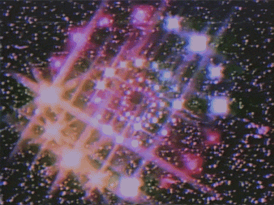

#### **whoismxuse ?**

I’m a blockchain and DLT focused SR dedicated to securing protocols through bug bounties, private audits, and continuous vulnerability research.

#### Highlights
- [Senior Immunefi All Star](https://immunefi.com/profile/okmxuse/)
- [CometBFT ASA-2025-003](https://github.com/cometbft/cometbft/security/advisories/GHSA-hrhf-2vcr-ghch) Discovered a severe CometBFT bug that left all implementing networks vulnerable to a complete halt.
- Reached 3rd on the 90 Day Leaderboard on Immunefi.
- Among the top researchers on [Cantina](https://cantina.xyz/u/mxuse)
- Multiple top 3 placements across competitions.
- Conducted multiple private engagements for leading blockchain and DLT protocols.

#### Socials
- [Audit Portfolio](https://audits.sherlock.xyz/watson/iammxuse)
- [Immunefi](https://immunefi.com/profile/okmxuse)
- [X](https://x.com/home)

